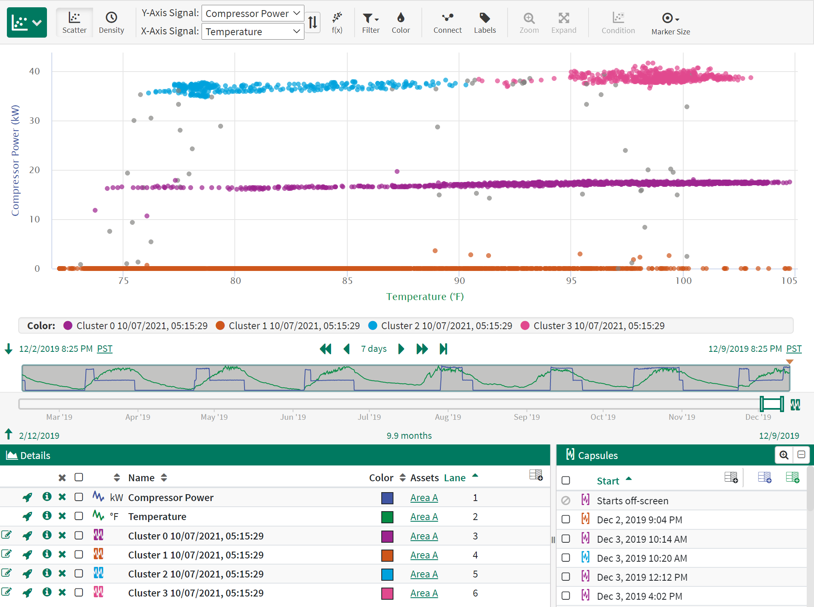
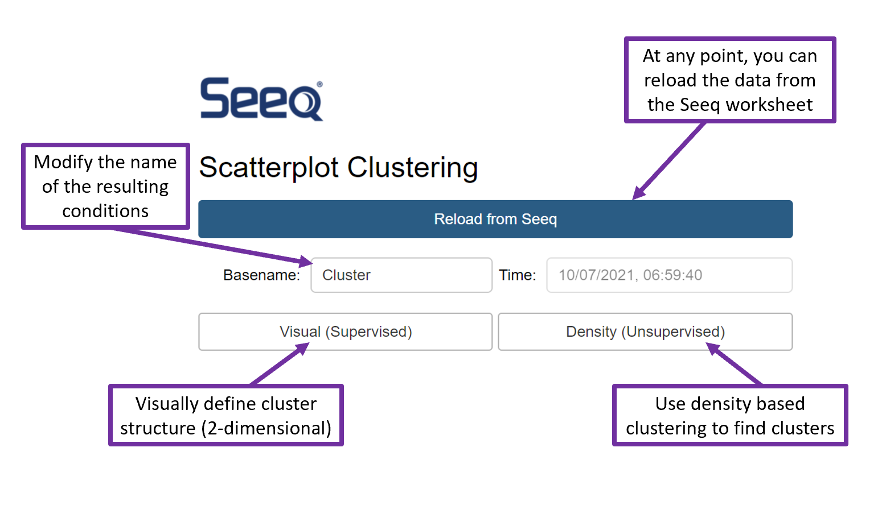
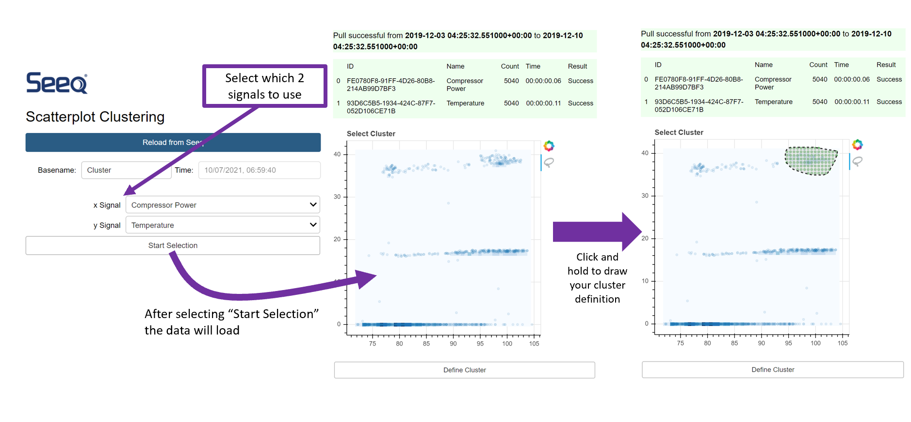
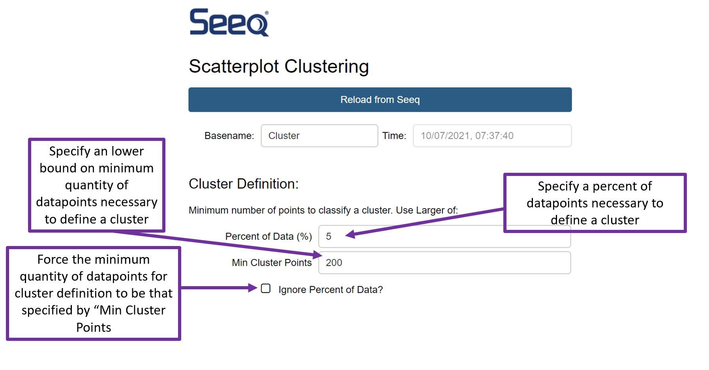
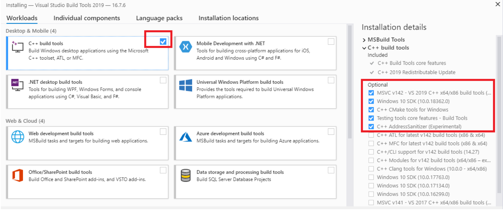

[](https://www.seeq.com)

[](https://www.seeq.com)

----

**seeq-clustering** is a plugin for Seeq, which allows for density based clustering of n-dimensional data. Clustering can be supervised (visual) or unsupervised (density based).

----

# User Guide

**seeq-clustering User Guide**

Seeq clustering determines cluster structure in data (either by finding regions of high density, or by manual definition) and returns each cluster as a Seeq condition. This can be useful for determining **regularly visited** regions in parameter space for a set of signals. Why this is important, is best understood by analogy. If you want to know how your car's gas mileage is performing over time, a naive way to monitor it is by recording, at the end of every month, your total number of miles driven and total gas used that month. This will give you a measure of how your gas mileage performs over time **but is it a good measure of how your car is performing?** Gas mileage depends on a variety of factors - outdoor air temperature, number of people in the car, speed *etc* - so a better measure of how your car is performing is by setting some set of parameters (*e.g.* 70 degrees, driving between 25 and 30mph with only 1 person in the car) and calculating your gas mileage **only** when your car is operating in that mode. By examing this, *gas mileage during known conditions*, over time, you have a much better measure of how your car is performing.

This is precisely the aim of the clustering addon. In a real process, it is more complicated than a car, and it is near impossible to know what set of conditions you should use to specify your monitoring periods (*e.g.* the 70 degrees, 1 person, from the car example). Clustering helps you with this. It gives you candidate parameter sets - regions in your data where spends a lot of time - so that you can compare how your process is performing *in a known, and consistent, parameter space*.

When you open the tool, you will be met with two options:



1. [Visual (Supervised)](#visual-supervised) - allows you to manually define a cluster boundary in 2-dimensional data
2. [Density (Unsupervised)](#density-unsupervised) - density based clustering to find clusters in n-dimensional data 

## Visual (Supervised)




## Density (Unsupervised)

See [explanation of density based parameters](#explanation-of-density-based-parameters) for detailed explanations of each input option for cluster definition. 



Whichever mode (Visual or Density) you choose, the form of the clusters returned in Seeq will look similar. Happy clustering!

### Explanation of Density Based Parameters

**Minimum Cluster Size (mcs)** - the minimum number of datapoints which much be including in a cluster for it to be classified as a viable cluster. A larger number will produce fewer clusters, which are contain more data each. 

- There are two ways to specify mcs. Either by specifying a number (*e.g.* "I want my clusters to contain no fewer that 200 points") or by a percent of the total number of data points (*e.g.* "I want my clusters to contain no less that 5% of the data"). 
***note*** *percent of datapoints is calculated based on Display Range.* 
- You may (indeed, likely) not know what the total number of datapoints is in your data, so it is recommended to supply both a `Percent of data (%)` and a `Min Cluster Points`. 
- If both `Percent of data (%)` and `Min Cluster Points` are supplied, the default behavior will be to use the **larger** of the two values for the mcs, *i.e.* 
,\left(&space;\text{Percent&space;of&space;Data&space;(%)}&space;\times&space;\text{Number&space;of&space;datapoints}\right&space;)\right]). 
You can override the behavior by checking the ``Ignore Percent of data?`` checkbox. Doing so will force `mcs = Min Cluster Points`

**Cluster Extent**

----

# Installation

The backend of **seeq-clustering** requires **Python 3.7** or later.

## Dependencies

See [`requirements.txt`](https://github.com/seeq12/seeq-clustering/blob/main/requirements.txt) file for a list of
dependencies and versions. Additionally, you will need to install the `seeq` module with the appropriate version that
matches your Seeq server. For more information on the `seeq` module see [seeq at pypi](https://pypi.org/project/seeq/)

## User Installation Requirements (Seeq Data Lab)

If you want to install **seeq-clustering** as a Seeq Add-on Tool, you will need:

- Seeq Data Lab (>= R50.5.0, >=R51.1.0, or >=R52.1.0)
- `seeq` module whose version matches the Seeq server version
- Access (and permissions) to machine running Seeq server
	- Knowledge or where [external calculation](https://seeq.atlassian.net/wiki/spaces/KB/pages/509509833/External+Calculation+Engine) scripts are located on that machine (see [User Installation](#user-installation) below)
- Enable Add-on Tools in the Seeq server

## User Installation

The latest source code of the project can be found [here](https://github.com/seeq12/seeq-clustering). The code is published as a
courtesy to the user, and it does not imply any obligation for support from the publisher. After ensuring that [Add-on tools are enabled](https://seeq.atlassian.net/wiki/spaces/KB/pages/961675391/Add-on+Tool+Administration+and+Development#Add-on-Tools-appear-in-an-%E2%80%9CAdd-ons%E2%80%9D-group-on-the-Seeq-Tools-panel.-These-tools-typically-open-an-appmode-SDL-notebook) in the Seeq server, follow the outlined steps below exactly. 

1. Create a **new** Seeq Data Lab project and open the **Terminal** window
2. Clone the seeq-clustering repository, run `git clone https://github.com/seeq12/seeq-clustering.git`
3. Navigate into the `seeq-clustering` directory (`cd seeq-clustering`) and install requirements `pip install -r requirements.txt`
4. Move two files (cut and paste, or download directly and move) `Clustering.py` and `_Clustering_config.py` to the external calculation folder on the machine where Seeq server is running (typically `'D:/Seeq/plugins/external-calculation/python/user/'` or similar)
5. In command line on the computer or server running Seeq (*not* seeq data lab terminal), navigate to the external calculation python folder (using the example from above): `cd D:/Seeq/plugins/external-calculation/python/user/`
6. Configure the location (on machine running Seeq Server) where clustering models will be stored. Run `python _Clustering_config.py clusteringModelsPath` The default is to store the models in the same location as dir as Clustering.py, *i.e.* `D:/Seeq/plugins/external-calculation/python/user/` in this example. If you wish to store your models elsewhere, and you have the required permissions Assuming you have permissions to access the path, this can be done by running `python _Clustering_config.py clusteringModelsPath <yourpathhere>`

If you are unable to run `python _Clustering_config.py` (*e.g.* if you do not have python installed on the Seeq server host machine), see [manual instructions](#manual-external-calc-clustering-config)

7. Follow the instructions in external-calc readme (typically located `~/D:/ProgramData/Seeq/data/plugins/external-calculation/python/readme.html`) to install `hdbscan`. Here is an exceprt from the readme, explaining how to do this:

	*Installation of additional libraries can be done by executing the following steps:*

	***Stop Seeq if already started***

	*You may stop seeq by using the Seeq Workbench.*

	***Install the new Python module(s)***

	*Go to the place where Seeq Server is installed (usually C:\Program Files\Seeq Server) and run `seeqprompt.bat`*

	*This will open a new cmd window and will setup the Python environment for the next commands.*

	*To install your own Python libraries, run in this window (seeqprompt window) the following command:*

	```
	python -m pip install hdbscan -t plugins\lib\python3
	### if you need to install additional packages, e.g. seeq, replace hdbscan with <packagename>
	```
	*where hdbscan is the name of the module we wish to install.*

	***Check and repair permissions***

	*If you run seeq as a service you will need to go to c:\ProgramData\Seeq\data\plugins\lib, select python3 folder, press right mouse, go to Properties , select Security tab, press Advanced, mark checkbox "Replace all child object permissions ..." press Apply, then Yes and then OK.*

	***Start Seeq***

	*Once you've finished these steps the newly installed module may be used in your external-calculation Python scripts.*

If you run into an error in installation of `hdbscan` see [note](#errors-in-hdbscan-ext-calc-install)

8. In any Seeq workbook, retrieve the checksum of the newly created Clustering.py external calc call. Wait a few moments for it to update, you should see the external-calc script show up (it will be called `Clustering.py:NUMERIC:<your_unique_checksum>`):


If you the checksum is not appearing see [here](#clustering-checksum-doesnt-show-in-seeq)

9. In your existing Seeq Data Lab **Terminal** window, navigate to `clustering` directory: `cd seeq-clustering/seeq/addons/clustering/`


10. Update your app to point to your unique checksum. Run `python _config.py checksum <yourchecksumhere>` where `<yourchecksumhere>` is that which you retrieved previously (from a Seeq workbook)

11. Note the URL of your Seeq Server instance (e.g. `https://my.seeq.com/`), and the URL of your Clustering `App.ipynb` notebook (located in the `seeq/addons/clustering/` directory), *e.g.* `https://my.seeq.com/data-lab/CBA9A827-35A8-4944-8A74-EE7008DC3ED8/notebooks/seeq-server/seeq/addons/clustering/App.ipynb`, you will need this in a moment.

12. Install the addon. In Seeq Data Lab **terminal**, return to the `seeq-clustering` directory: `cd ~/seeq-clustering`. Run `python _install_addon.py --username <username> --password <password> --seeq_url <seeq_server_url> --app_url <app_notebook_url>`, where `<seeq_server_url>` and `<app_notebook_url>` are the urls for the server and specific url for the clustering App notebook, respectively.

Here is an example:

```bash
python _install_addon.py --username me@me.com --password mypass --seeq_url https://my.seeq.com/ --app_url https://my.seeq.com/data-lab/6E8C6D21-50BB-4209-8B8D-4B6A8D94E5C2/notebooks/hb/seeq/addons/clustering/App.ipynb
```

There are additional **Options** for the addon installation. These include `--users` and `--groups`. These can be used to change permissions for the addon tool. For example to give permission to users `me` and `you` one would install the addon with as:

```bash
python _install_addon.py --username me@me.com --password mypass --seeq_url https://my.seeq.com/ --app_url https://my.seeq.com/data-lab/6E8C6D21-50BB-4209-8B8D-4B6A8D94E5C2/notebooks/hb/seeq/addons/clustering/App.ipynb --users me you
```

### Troubleshooting Install

#### Manual external-calc Clustering Config

To manually update the cluster model path, open `Clustering.py` in a text editor. The top two lines should be:

```
#DO NOT CHANGE THE FOLLOWING LINE OR THIS LINE
wkdir = ''
```

Manually enter the path where you wish to save the clustering models by updating the wkdir variable (yes, this means ignoring the warning in the first line and YES change line 2. To replicate default behavior, updated `wkdir` to be the same **absolute** path as the directory which holds `Clustering.py`, e.g.:

```
wkdir = 'D:/Seeq/plugins/external-calculation/python/user/'
```

#### Errors in hdbscan ext-calc install

If you encounter the error 
```
error: Microsoft Visual C++ 14.0 or greater is required. Get it with "Microsoft C++ Build Tools": https://visualstudio.microsoft.com/visual-cpp-build-tools/
  ----------------------------------------
  ERROR: Failed building wheel for hdbscan
Failed to build hdbscan
ERROR: Could not build wheels for hdbscan which use PEP 517 and cannot be installed directly
```

simply follow the link provided in the error (https://visualstudio.microsoft.com/visual-cpp-build-tools/) and download and install Microsoft C++ Build Tools. Follow the download instructions and install the defaults for Microsoft C++ Build Tools:

<p align="center"><a href="https://visualstudio.microsoft.com/visual-cpp-build-tools/">
  
</a></p>
<p align = "center">
  
</p>

You will likely then have to close your command prompt, and rerun `seeqprompt.bat` before attempting to install hdbscan again (see [steps](#pip-install-hdbscan-for-external-calc))

#### Clustering checksum doesn't show in Seeq

If you had to do [manually setup for clustering config](#Manual-external-calc-Clustering-Config), ensure that no `\` were used in the absolute path. Replace with `/`.

Ensure you are using the correct path `~/external-calculation/python/user/` for your instance of Seeq that is currently running. 

You may have to [install seeq](https://pypi.org/project/seeq/) for external calc. See instructions [above](#pip-Install-hdbscan-for-external-calc)

#### Updating External Calc

If you update the external calc code for any reason (maybe change model storage location for example), a new, unique checksum will be generated. You must reconfigure the app in this scenario by following [these steps above](#Run-the-following-command-to-update-your-instance-of-clustering-to-point-to-your-instance-of-the-external-calc-script)

----

# Development

We welcome new contributors of all experience levels. The **Development Guide** has detailed information about
contributing code, documentation, tests, etc.

## Important links

* Official source code repo: https://github.com/seeq12/seeq-clustering
* Issue tracker: https://github.com/seeq12/seeq-clustering/issues

## Source code

You can get started by cloning the repository with the command:

```shell
git clone git@github.com:seeq12/seeq-clustering.git
```

----

# Changelog

The change log can be found [**here**](https://seeq12.github.io/seeq-clustering/changelog.html)


----

# Support

Code related issues (e.g. bugs, feature requests) can be created in the
[issue tracker](https://github.com/seeq12/seeq-clustering/issues)
Any other general comments or questions (non-code related) can be emailed to
[Seeq](mailto:applied.research@seeq.com?subject=[seeq-clustering]%20General%20Question)

Maintainer: Eric Parsonnet


----

# Citation

Please cite this work as:

```shell
seeq-clustering
Seeq Corporation, 2021
https://github.com/seeq12/seeq-clustering
```


