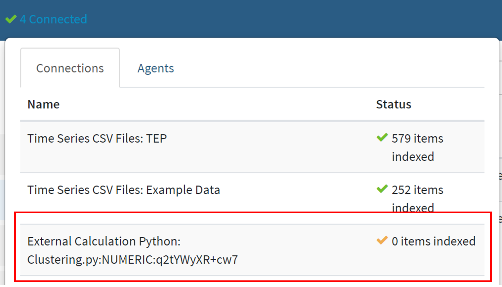
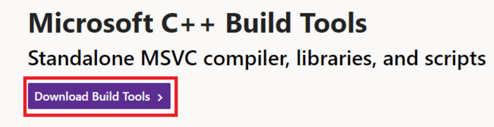

# Clustering

## External Calc Installation and Configuration:

1. Clone this repo to Seeq Data Lab
2. Move two files (cut and paste, or download directly and move) `./seeq/addons/clustering/Clustering.py` and `./seeq/addons/clustering/_Clustering_config.py` to the external calculation folder on the machine where Seeq server is running (typically `'D:/Seeq/plugins/external-calculation/python/user/'` or similar)

**Ensure the next steps are done in the correct order**

3. In command line on the computer or server running Seeq (*not* seeq data lab terminal), navigate to the external calculation python folder (using the example from above):
```bash
> cd D:/Seeq/plugins/external-calculation/python/user/
```
4. Configure the local location where clustering models will be stored:

```bash
> python _Clustering_config.py clusteringModelsPath
```

The default is to store the models in the same location as where Clustering.py lives. 

You may also wish to store your models elsewhere. Assuming you have permissions to access the path, this can be done as:

```bash
> python _Clustering_config.py clusteringModelsPath <yourpathhere>
```

If you are unable to run `_Clustering_config.py` (e.g. if you do not have python installed), see [manual instructions](#manual-external-calc-clustering-config)

### Install hdbscan for external-calc

5. Follow the instructions in external-calc readme, typically located `~/D:/ProgramData/Seeq/data/plugins/external-calculation/python/readme.html` to install `hdbscan`. Here is an exceprt from the readme, explaining how to do this:

		Installation of additional libraries can be done by executing the following steps:

		**Stop Seeq if already started**

		You may stop seeq by using the Seeq Workbench.

		**Install the new Python module(s)**

		Go to the place where Seeq Server is installed (usually C:\Program Files\Seeq Server) and run `seeqprompt.bat`

		This will open a new cmd window and will setup the Python environment for the next commands.

		To install your own Python libraries, run in this window (seeqprompt window) the following command:

		```
		> python -m pip install hdbscan -t plugins\lib\python3
		```
		where hdbscan is the name of the module we wish to install.

		**Check and repair permissions**

		If you run seeq as a service you will need to go to c:\ProgramData\Seeq\data\plugins\lib, select python3 folder, press right mouse, go to Properties , select Security tab, press Advanced, mark checkbox "Replace all child object permissions ..." press Apply, then Yes and then OK.

		**Start Seeq**

		Once you've finished these steps the newly installed module may be used in your external-calculation Python scripts.

If you run into an error in installation of `hdbscan` see [note](#errors-in-hdbscan-ext-calc-install)

6. In Seeq Workbench retrieve the checksum of the newly created Clustering.py external calc call. Wait a few moments for it to update, you should see the external-calc script show up (it will be called `Clustering.py:NUMERIC:<your_unique_checksum>`:

<p align="center">
  
</p>

then in your Clustering SDL, open an SDL terminal and navigate to `clustering` directory:

```bash
> cd ./hb/seeq/addons/clustering/
```

7. Run the following command to update your instance of clustering to point to your instance of the external calc script:

```bash
> python _config checksum <yourchecksumhere>
```

where `<yourchecksumhere>` is from Seeq Workbench. Here is an example: `Clustering.py:NUMERIC:q2tYWyXR+cw7`

8. Install the necessary requirements in SDL: (we need hdbscan here too)

```bash
pip install hdbscan
```

9. Ensure that add-on tools are enabled in your version of Seeq. For instructions on how to do this, see 
[here](https://seeq.atlassian.net/wiki/spaces/KB/pages/961675391/Add-on+Tool+Administration+and+Development#Add-on-Tools-appear-in-an-%E2%80%9CAdd-ons%E2%80%9D-group-on-the-Seeq-Tools-panel.-These-tools-typically-open-an-appmode-SDL-notebook)

10. Note the URL of your Seeq Server instance (e.g. `https://my.seeq.com/`), and the URL of your Clustering app notebook (e.g. `https://my.seeq.com/data-lab/CBA9A827-35A8-4944-8A74-EE7008DC3ED8/notebooks/hb/seeq/addons/clustering/App.ipynb`) then run the following command in SDL terminal in the hb directory.

```
cd ~/hb
```

```bash
python _install_addon.py --username <username> --password <password> --seeq_url <seeq_server_url> --app_url <app_notebook_url>
```

where `<seeq_server_url>` and `<app_notebook_url>` are the urls for the server and specific url for the clustering App notebook, respectively.

 - Options on install:
 
 Todo


# Manual external-calc Clustering Config

To manually update the cluster model path, open `Clustering.py` in a text editor. The top two lines should be:

```
#DO NOT CHANGE THE FOLLOWING LINE OR THIS LINE
wkdir = ''
```

Manually enter the path where you wish to save the clustering models by updating the wkdir variable (yes, this means ignoring the warning in the first line and YES change line 2. To replicate default behavior, updated `wkdir` to be the same **absolute** path as the directory which holds `Clustering.py`, e.g.:

```
wkdir = 'D:/Seeq/plugins/external-calculation/python/user/'
```

# Errors in hdbscan ext-calc install

If you encounter the error 
```
error: Microsoft Visual C++ 14.0 or greater is required. Get it with "Microsoft C++ Build Tools": https://visualstudio.microsoft.com/visual-cpp-build-tools/
  ----------------------------------------
  ERROR: Failed building wheel for hdbscan
Failed to build hdbscan
ERROR: Could not build wheels for hdbscan which use PEP 517 and cannot be installed directly
```

simply follow the link provided in the error (https://visualstudio.microsoft.com/visual-cpp-build-tools/) and download and install Microsoft C++ Build Tools. Follow the download instructions and install the defaults for Microsoft C++ Build Tools:

<p align="center"><a href="https://visualstudio.microsoft.com/visual-cpp-build-tools/">
  
</a></p>
<p align = "center">
  
</p>

You will likely then have to close your command prompt, and rerun `seeqprompt.bat` before attempting to install hdbscan again (see [steps](#install-hdbscan-for-external-calc))

# Clustering checksum doesn't show in Seeq

If you had to do [manually setup for clustering config](#errors-in-hdbscan-ext-calc-install), ensure that no '\' were used in the absolute path. Replace with '/'.

Ensure you are using the correct path `~/external-calculation/python/user/` for your instance of Seeq that is currently running. 

You may have to [install seeq](https://pypi.org/project/seeq/) for external calc. See instructions [above](#Install-hdbscan-for-external-calc)

# Updating 

If you update the external calc code for any reason (maybe change model storage location for example), a new, unique checksum will be generated. You must reconfigure the app in this scenario by following [these steps above](#Run-the-following-command-to-update-your-instance-of-clustering-to-point-to-your-instance-of-the-external-calc-script)